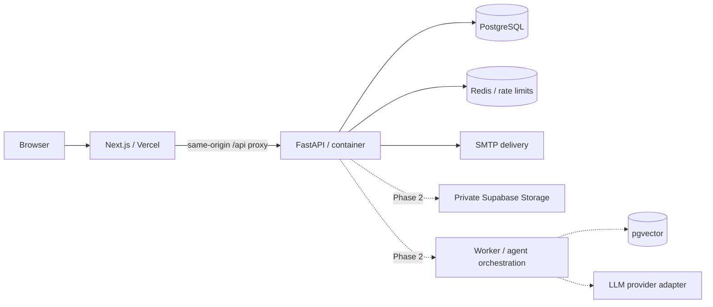

# Nexora architecture — design before implementation

## Scope and milestones
Phase 1 delivers identity, all seven role policies, public discovery, twelve-step saved onboarding, startup profiles, application submission/history, reviewer assignment, private notes, information requests, interviews, cohorts, account administration and auditing. Phase 2 adds document ingestion, evidence-based AI evaluations, streaming copilot and Founder OS. Phase 3 adds matching, mentoring and challenge workflows. Phase 4 adds consent-based investor access and fundraising. Phase 5 adds plan-only MVP workspaces, analytics and integrations. Phase 6 adds durable agent workflows and marketplace capabilities. Future services are design contracts, not fake functional screens.

## Deployment and trust boundaries

The browser receives an HttpOnly, same-site session cookie; it never receives database, storage service-role or LLM secrets. Next.js proxies to a configured backend. FastAPI enforces authorization independently of the UI. PostgreSQL is the production system of record; SQLite is an explicit local/test alternative. Domain operations run inside transactions. Alembic owns schema upgrades. No schema auto-creation on production startup. Use a dedicated DB role; do not expose the application's schema through Supabase's public REST API. Direct database credentials are a trusted server boundary.

## Folder structure
```text
apps/web/       Next.js App Router, screens, hooks, accessible UI
apps/api/app/   FastAPI routes, Pydantic contracts, SQLAlchemy domain, security
apps/api/alembic/ versioned database migrations
packages/ui/   design tokens and component ownership notes
packages/types/ generated OpenAPI contract
packages/config/ shared configuration conventions
packages/ai/   provider, registry and future execution contracts
docs/          architecture, ERD, API, security, runbook
infrastructure/ container and PostgreSQL deployment
tests/         API/security and browser critical paths
```

## Authentication and RBAC
Passwords use Argon2id. Opaque random sessions are hashed in the database, expire after 12 hours, and can be individually revoked or revoked together after password reset. Roles are read from the database on every request, so suspension and role changes apply immediately. Registration can create only FOUNDER or COFOUNDER. Other roles are assigned by SUPER_ADMIN; ADMIN cannot grant itself privileges. Email tokens are hashed, purpose-bound, short-lived and single-use. Password reset revokes sessions. Production requires SMTP, TLS cookies, Redis and PostgreSQL. Development verification links are only returned in explicit development mode; never log token URLs. OAuth is an adapter boundary for future OIDC state/nonce/PKCE flows, not an enabled login button.

| Role | Permissions |
|---|---|
| FOUNDER | Own profile, own startup, own application, submit after email verification |
| COFOUNDER | Own profile and own startup membership; no cross-startup access |
| REVIEWER | Assigned applications, private notes, founder-visible information requests; no acceptance decisions |
| MENTOR | Own profile; assigned startup access reserved for Phase 3 |
| INVESTOR | Public opt-in startup summaries; private data requires Phase 4 explicit grants |
| ADMIN | Review all applications, assign reviewers, status changes, interviews, cohorts, suspend non-admin users |
| SUPER_ADMIN | ADMIN plus role changes and administrative account management |

Resource access is deny-by-default with ownership/assignment checks at each API boundary. Unauthorized object IDs return 404. Reviewer notes are omitted entirely from founder DTOs. Sensitive startup answers are never included in public directory responses. Public startup publication is explicitly opt-in. Mutating browser requests require a configured Origin; same-site cookies, origin checking and a required custom header prevent CSRF. Responses are not cached. Rate limits use Redis in production, memory only in single-process development. Never trust arbitrary forwarded IP headers.

## Application state machine
DRAFT → SUBMITTED → SCREENING → AI_REVIEW → HUMAN_REVIEW → INTERVIEW → SHORTLISTED → ACCEPTED. SCREENING can go straight to HUMAN_REVIEW when AI is unconfigured. Review stages can move to WAITLISTED/REJECTED; WAITLISTED can return to HUMAN_REVIEW. Every transition uses a compare-and-set update and atomically writes immutable status history, audit event and notification. Only humans with ADMIN/SUPER_ADMIN can decide. Submitted answers are a snapshot; editable profile changes do not alter historical submissions. Founder replies are separate messages.

## AI agent architecture (Phase 2 contract)
Registry entries contain id, system instructions, allowed tools, context policy, memory policy and output schema. Agents: founder, market-research, product, growth, sales, finance, fundraising, research, startup-evaluation, cofounder-matching, mentor and mvp-planning. Provider interface supports streaming, embedding and structured tool calls; a missing provider fails explicitly with configuration-required. No deterministic demo responses in production.

Evaluation graph: normalize → research → parallel domain analysis → risk → collect evidence → human review. Each step persists a run ID, user/startup IDs, tool names, redacted metadata, elapsed time, status and sanitized error. A LangGraph adapter can execute the same agent contracts. Jobs require durable queue retries, timeouts and idempotency keys. Tools are allowlisted per agent; no shell execution. Acceptance decisions are excluded from every tool registry.

RAG: authorize upload → validate file signature/size → malware scan → extract in isolated worker → chunk → embed → persist document and startup-scoped vectors. Every retrieval requires a server-derived startup_id and authorized document IDs, with PostgreSQL RLS as defense in depth before enabling direct/vector access. Use private buckets and short-lived signed URLs only after authorization. Treat document text as untrusted data, never instructions. Citations include document/chunk IDs. Revoking access must also invalidate retrieval and signed URL caches. Investor retrieval requires explicit founder grants. No RAG implementation is claimed in Phase 1.

## Screens
Public: /, /about, /how-it-works, /startups, /founders, /investors, /programs, /challenges, /resources, /pricing, /apply.
Identity: /login, /register, /forgot-password, /reset-password, /verify-email.
Phase 1 private: /dashboard, /onboarding, /startup, /application, /settings, /admin; /mentor and /investor are role landing pages with accurate rollout states.
Future: /ai-copilot, /cofounder, /fundraising, /mvp-builder, /analytics. These are not represented as working features.

## Verification strategy
API tests exercise registration, verification, invalid credentials, session revocation, draft persistence, completeness, submit idempotency, state transitions, assignment filtering, private-note redaction, cross-tenant IDs, investor restrictions and privileged-role escalation. Browser tests exercise founder application flow and responsive navigation. Production build and TypeScript checks validate the web app. PostgreSQL CI runs the migration and the same database tests against real PostgreSQL. Production launch additionally requires real email delivery, TLS/domain configuration, backups/restore drill and deployment smoke tests.
## Framework references
Implementation conventions follow the installed Next.js App Router documentation and [official Next.js installation guidance](https://nextjs.org/docs/app/getting-started/installation). Password hashing follows [FastAPI security guidance](https://fastapi.tiangolo.com/tutorial/security/oauth2-jwt/); Nexora uses revocable opaque sessions instead of browser-held bearer tokens. Local PostgreSQL validation used an isolated runtime from [embedded-postgres](https://github.com/leinelissen/embedded-postgres), outside production dependencies.
