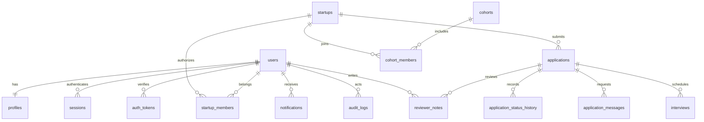

# Database schema and ERD

All IDs are UUID strings; all timestamps UTC. Foreign keys have explicit delete behavior. Tenant data uses startup_id and membership access checks. Most root records have deleted_at; history and audit records are append-only. JSON answers use validated Pydantic structure at the API boundary; PostgreSQL stores them as JSON. Financial values are submitted as text at Phase 1 rather than used for financial calculations.

Phase 1 physical schema: users(email UNIQUE, password_hash, role CHECK, verified, suspended, deleted_at); profiles(user_id UNIQUE FK, name, data JSON); sessions(token_hash UNIQUE, user_id FK INDEX, expires_at); auth_tokens(token_hash UNIQUE, purpose, user_id FK, expires_at, used_at); startups(owner_id FK INDEX, name, industry, stage, description, website, public, answers JSON, version, deleted_at); startup_members(startup_id FK, user_id FK, UNIQUE pair); applications(startup_id FK INDEX, owner_id FK, cycle, UNIQUE startup/cycle, status CHECK INDEX, answers JSON, reviewer_id FK INDEX, submitted_at, version); application_status_history(application_id FK INDEX, actor_id FK, from_status, to_status, created_at); reviewer_notes(application_id FK, author_id FK, body); application_messages(application_id FK, author_id FK, kind, body); interviews(application_id FK, scheduled_at, location); notifications(user_id FK INDEX, title, body, read_at); audit_logs(actor_id FK, action, resource_id, metadata JSON); cohorts(name UNIQUE, description); cohort_members(cohort_id FK, startup_id FK, UNIQUE pair); challenges(title, description, industry, deadline, prize, demo).

## Evolution schema (future migrations, not empty runtime tables)
Each row below describes the authoritative planned relational model. Root tables have id/created_at/updated_at; join tables have unique FK pairs. These tables are introduced with the phase that owns their behavior to avoid pretending unimplemented features exist.

| Phase | Tables and primary relationships |
|---|---|
| 2 | founders(user_id UNIQUE FK); founder_skills(founder_id FK, skill UNIQUE pair); teams(startup_id FK); startup_profiles(startup_id UNIQUE FK); application_answers(application_id FK, question_key UNIQUE pair; migration from snapshot JSON); startup_documents(startup_id FK INDEX, uploader_id FK, storage_key UNIQUE, mime, size, status); document_chunks(document_id FK, startup_id FK INDEX, embedding vector, text); evaluations(application_id FK, run_id FK, status); evaluation_criteria(evaluation_id FK, dimension); evaluation_evidence(criterion_id FK, document_id FK nullable, source_url, quotation) |
| 2 | ai_conversations(startup_id FK, user_id FK); ai_messages(conversation_id FK INDEX, role, content); ai_agent_tasks(startup_id FK, agent_id, status); ai_runs(task_id FK, user_id FK, startup_id FK, agent, tools JSON, metadata JSON, duration, status, error); ai_memory(startup_id FK INDEX, agent, document_id FK, expiry) |
| 3 | cofounder_profiles(user_id UNIQUE FK, visibility, skills JSON, commitment); cofounder_matches(left_id FK, right_id FK, UNIQUE pair, explanation JSON); connection_requests(sender_id FK, recipient_id FK, UNIQUE pair, status); mentors(user_id UNIQUE FK); mentor_profiles(mentor_id UNIQUE FK); mentor_assignments(mentor_id FK, startup_id FK UNIQUE pair); mentor_sessions(assignment_id FK, scheduled_at); mentor_notes(session_id FK, visibility); program_tasks(cohort_id FK, startup_id FK, assignee_id FK); milestones(startup_id FK, due_at, completed_at); challenge_submissions(challenge_id FK, startup_id FK UNIQUE pair); challenge_evaluations(submission_id FK, reviewer_id FK) |
| 4 | investors(user_id UNIQUE FK); investor_profiles(investor_id UNIQUE FK); investor_preferences(investor_id FK); investor_watchlists(investor_id FK, startup_id FK UNIQUE pair); funding_rounds(startup_id FK, target NUMERIC, currency); funding_interests(round_id FK, investor_id FK UNIQUE pair, stage CHECK); investor_introductions(investor_id FK, startup_id FK, consent_at); data_access_grants(startup_id FK, investor_id FK, document_id FK nullable, expires_at, revoked_at) |
| 5 | startup_metrics(startup_id FK, period DATE, metric, value NUMERIC, UNIQUE startup/period/metric); mvp_projects(startup_id FK); mvp_requirements(project_id FK, content); mvp_tasks(project_id FK, status, dependencies JSON) |

PostgreSQL full-text directory search uses a GIN expression index over public startup name, industry and description. Other entity search ships alongside each owning phase. Future vectors use pgvector with tenant filters applied before similarity ranking. No table should rely on client-supplied ownership IDs as proof of permission.
